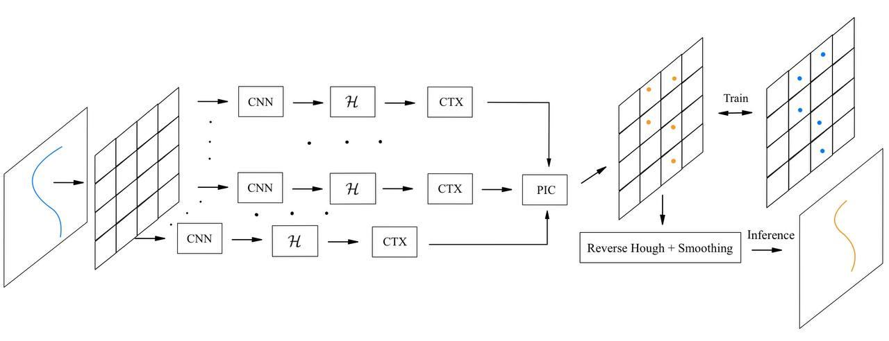

  
    <h1> Position Informed Convolution for Multi-Agent Curve Detection </h1>

  
    

<table>
    <tr>
        <td align="left"> <b> Title </b> </td>
        <td> Position Informed Convolution for Multi-Agent Line Detection </td>
    </tr>
    <tr>
        <td align="left"> <b> Author </b> </td>
        <td> Petr Babkin </td>
    </tr>
    <tr>
        <td align="left"> <b> Consultant </b> </td>
        <td> Nikita Shubin, PhD </td>
    </tr>
    <tr>
        <td align="left"> <b> Year </b> </td>
        <td> 2024-2025 </td>
    </tr>
</table>

## Description

## Annotation

## TODO

## Links
- [LinkReview](https://github.com/petr-parker/position-informed-convolution/blob/main/assets/LinkReview.md)
- [Overleaf](https://www.overleaf.com/7418856895cvhqhmpxvngm#63b794)
- [Paper](https://github.com/petr-parker/position-informed-convolution/blob/main/assets/PIC.pdf)
- [Slides](https://github.com/petr-parker/position-informed-convolution/blob/main/assets/PIC_slides.pdf)
- [Code](https://github.com/petr-parker/position-informed-convolution/tree/main/code)

